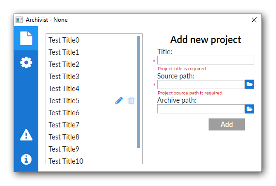

# Archivist
Archivist is an application that supplements version control system. User can select Visual Studio project that he wants to work on. After pressing the shortcut (Ctrl + S) Archivist will create backup copy of all project's source files and will save them in selected folder.

  

Development of this application is recorded at my blog [kkolodziejczak.net](http://kkolodziejczak.net).
Blog is written in Polish so feel free to use google translate.

## Download
The application is not finished yet. As soon as it is finished, a download link will be added.

## Used resources
- [Lato](http://www.latofonts.com/lato-free-fonts/#download) - Main font
- [FontAwsome](http://fontawesome.io/) - Font used for buttons
- [MaterialPalette](https://www.materialpalette.com/) - Color scheme for application
- [MaterialUI](https://www.materialui.co/) - Additional colors

## Requirements set by me
- One executable file
- Application should release space so that it can continue its work.

## License
Archivist is distributed under MIT License.

## Feedback
All bugs, feature requests, pull requests, feedback, are welcome. [Create an issue](https://github.com/kkolodziejczak/Archivist/issues).
